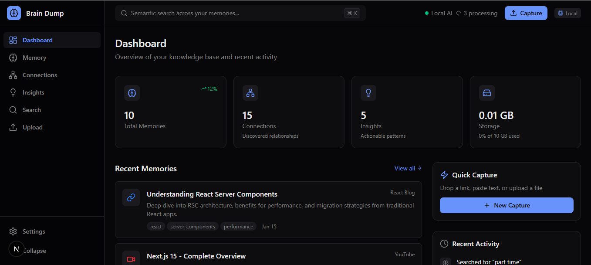
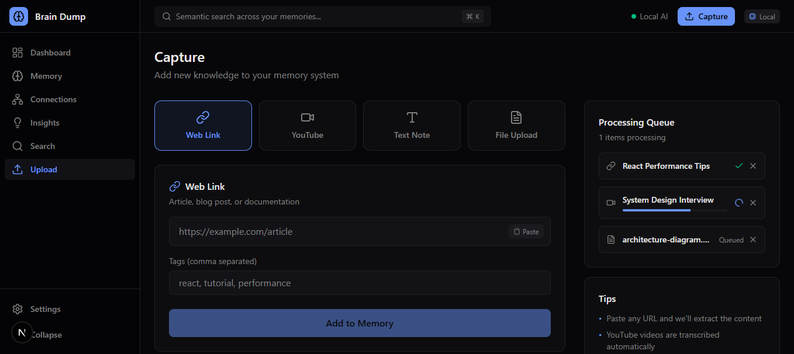
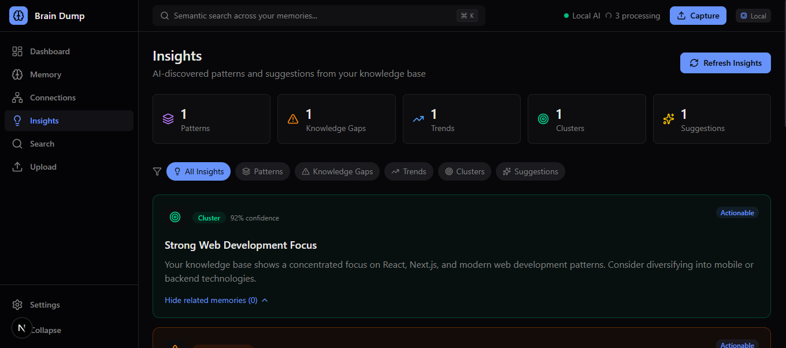
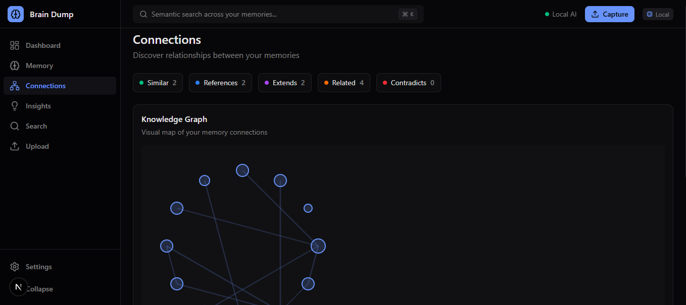

# Brain Dump

Local-first second brain MVP for the hackathon: capture text, URLs, PDFs, images, project files, audio, and video; extract/transcribe content; build embeddings; discover connections; and search semantically.

## Problem Statement

Knowledge workers collect information across many disconnected formats and tools: links, notes, PDFs, screenshots, audio, video, and project files. Traditional folder search and keyword search fail when users do not remember exact filenames, terms, or where content was stored.

Brain Dump solves this by turning mixed-format personal data into a unified, searchable memory layer. It extracts and transcribes content, builds embeddings, and returns the most relevant results through semantic search, so users can retrieve context and connections from their full knowledge base with a single query.

## Product Slides

### Slide 1
<a id="slide-1"></a>



[< Previous](#slide-4) | [Next >](#slide-2)

### Slide 2
<a id="slide-2"></a>



[< Previous](#slide-1) | [Next >](#slide-3)

### Slide 3
<a id="slide-3"></a>



[< Previous](#slide-2) | [Next >](#slide-4)

### Slide 4
<a id="slide-4"></a>



[< Previous](#slide-3) | [Next >](#slide-1)

## MVP Architecture

- Frontend: Next/React app in `brain-dump-frontend`
- Backend: FastAPI app in `backend`
- Storage: SQLite in `backend/data` by default
- Embeddings: local deterministic embeddings by default, optional Google embedding API
- Summaries: `gemma-4-26b-a4b-it` via Google AI Studio API
- Transcription: Whisper for audio/video

Postgres + pgvector is still the recommended production direction. For the hackathon, SQLite keeps the demo lightweight for Windows users and preserves an easy migration path because the API contract is separate from the storage implementation.

## Start Backend

```cmd
start-backend.cmd
```

Or manually:

```cmd
cd backend
python -m venv .venv
.venv\Scripts\python.exe -m pip install -r requirements.txt
.venv\Scripts\python.exe -m uvicorn app.main:app --reload --port 8765
```

## Start Frontend

```cmd
start-frontend.cmd
```

If dependencies are not installed yet:

```cmd
cd brain-dump-frontend
npm.cmd install
npm.cmd run dev
```

The frontend reads `NEXT_PUBLIC_API_URL` and defaults to `http://127.0.0.1:8765`.

## Gemma 4 (`gemma-4-26b-a4b-it`) / Whisper Config

Create `backend\app\.env` by copying values from `backend\app\.env.example`.

If Whisper is used, install `ffmpeg` on Windows. Without external providers, the backend falls back gracefully.

## Hackathon Demo Flow

1. Start the backend and frontend.
2. Open Capture and add a note or URL.
3. Add another related note.
4. Use Semantic Search with natural language.
5. Open Connections to show the local knowledge graph.
6. Open Insights to show generated clusters and suggestions.

## API

- `POST /api/capture/text`
- `POST /api/capture/url`
- `POST /api/capture/file`
- `GET /api/search?q=...`
- `GET /api/memories`
- `GET /api/memories/{id}`
- `GET /api/connections`
- `GET /api/insights`
- `GET /api/status`
